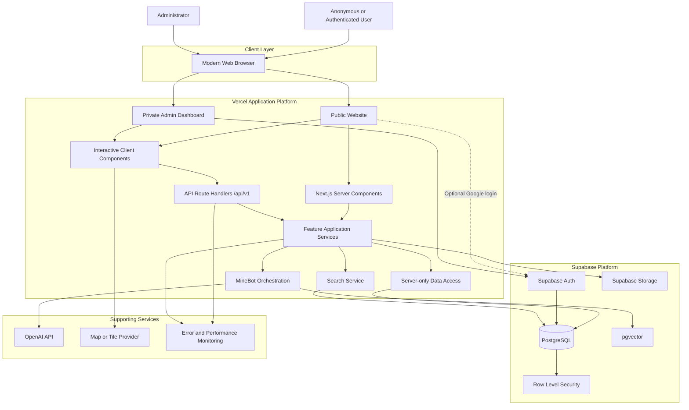
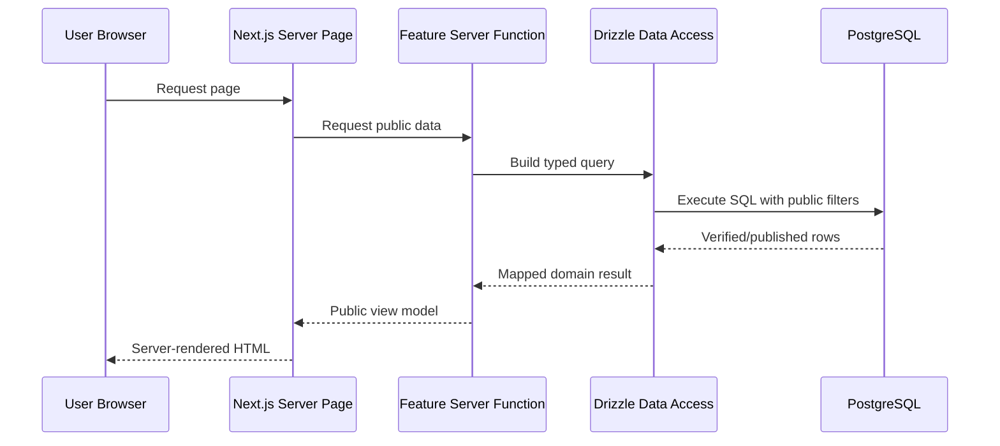
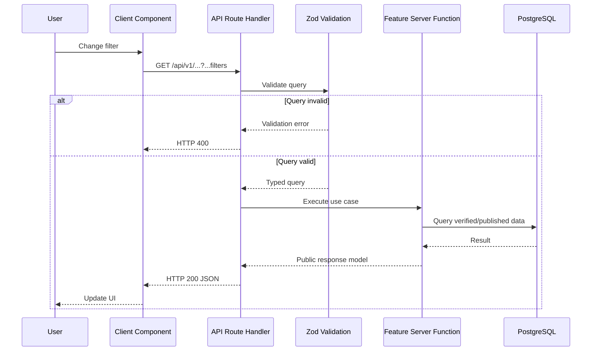
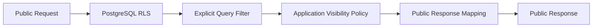
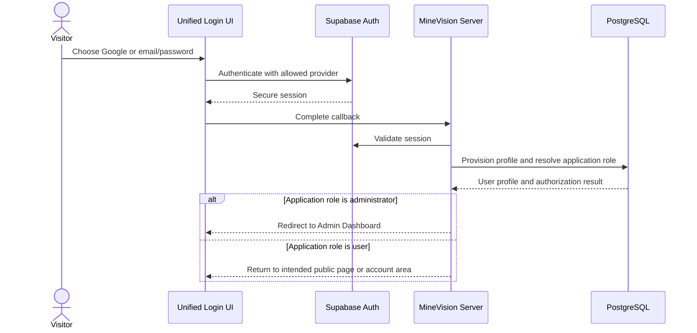
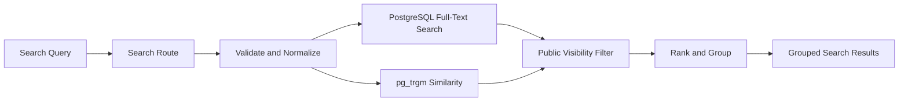
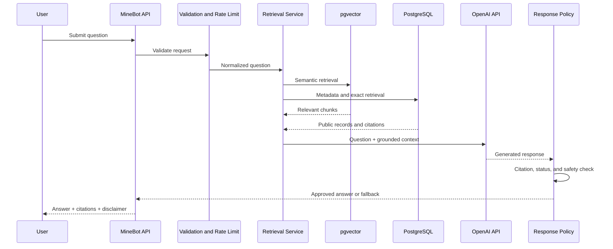
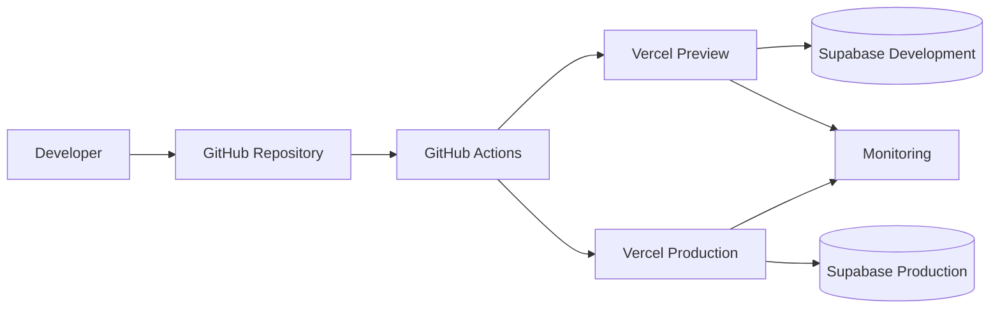

# MineVision Intelligence Platform Indonesia

## System Architecture

| Field              | Detail                                            |
| ------------------ | ------------------------------------------------- |
| Product            | MineVision Intelligence Platform Indonesia (MVIP) |
| Document           | System Architecture                               |
| Version            | 1.1 Draft                                         |
| Status             | Planning Review                                   |
| Product Owner      | Muhammad Fachri Athallah Sofyan                   |
| Architecture Style | Modular Full-Stack Monolith                       |
| Deployment Model   | Vercel + Supabase                                 |
| Last Updated       | 26 August 2026                                    |

> Dokumen ini menjadi sumber utama untuk arsitektur sistem, teknologi, struktur kode, aliran data, integrasi layanan, deployment topology, dan keputusan teknis MineVision. Struktur database dijelaskan dalam `SCHEMA.md`, UI/UX dalam `DESIGN.md`, kebutuhan produk dalam `PRD.md`, dan aturan engineering dalam `RULES.md`.

---

## 1. Architecture Overview

MineVision Intelligence Platform Indonesia menggunakan arsitektur **modular full-stack monolith** berbasis Next.js.

Frontend, server-rendered pages, backend application logic, dan HTTP API berada dalam satu codebase dan satu application deployment. Pemisahan tanggung jawab dilakukan secara logis melalui route, feature module, server module, data-access function, database schema, dan shared component.

Arsitektur ini dipilih karena MineVision dikembangkan secara bertahap oleh tim kecil atau individual developer. Modular monolith memberikan struktur yang jelas tanpa menambah kompleksitas jaringan dan operasional seperti yang muncul pada microservices.

Komponen eksternal, seperti PostgreSQL, authentication, storage, monitoring, peta, dan AI, tetap dikelola sebagai managed services yang berkomunikasi dengan aplikasi melalui koneksi atau API yang terkontrol.

### 1.1 Architecture Objectives

Arsitektur MineVision harus:

- mempertahankan pemisahan antara UI, business logic, data access, dan database;
- mencegah data non-publik keluar melalui website atau API publik;
- mendukung pengembangan fitur secara modular;
- menjaga konsistensi data antarhalaman dan modul;
- mendukung server-side rendering dan interaksi client-side;
- menyediakan API publik yang terversi;
- mendukung optional authenticated user melalui Google tanpa membatasi akses anonim ke konten publik;
- mendukung private admin dashboard;
- mendukung Global Search dan MineBot AI;
- memungkinkan pengujian otomatis;
- dapat dijalankan pada development, preview, dan production;
- dapat dikembangkan tanpa perubahan fundamental pada komponen inti.

### 1.2 Architecture Status Terminology

Dokumen ini menggunakan tiga status implementasi:

| Status      | Meaning                                                                            |
| ----------- | ---------------------------------------------------------------------------------- |
| Implemented | Sudah tersedia pada codebase atau database saat ini                                |
| Planned     | Sudah diputuskan sebagai target arsitektur, tetapi belum selesai diimplementasikan |
| Conditional | Hanya diterapkan jika data, biaya, kebutuhan, atau evaluasi teknis mendukung       |

---

## 2. Architecture Style

### 2.1 Modular Full-Stack Monolith

MineVision menggunakan satu repository dan satu aplikasi Next.js untuk:

- public website;
- private admin dashboard;
- server-rendered pages;
- HTTP API;
- validation;
- application services;
- data access;
- MineBot orchestration;
- search orchestration.

Modularitas tidak dicapai melalui service deployment terpisah, tetapi melalui batas folder, import, domain feature, server-only module, schema, dan kontrak API.

### 2.2 Why Not Microservices

Microservices belum digunakan karena:

- ukuran tim belum membutuhkan service ownership terpisah;
- beban operasional akan meningkat;
- deployment dan debugging menjadi lebih kompleks;
- transaksi data lintas service menjadi lebih sulit;
- biaya monitoring dan infrastructure meningkat;
- kebutuhan MineVision masih dapat dipenuhi oleh modular monolith.

Microservices hanya dipertimbangkan apabila suatu komponen memiliki kebutuhan scaling, keamanan, deployment, atau ownership yang benar-benar independen.

Contoh komponen yang suatu saat mungkin dipisahkan:

- asynchronous document ingestion;
- large-scale embedding generation;
- AI evaluation worker;
- intensive geospatial processing;
- scheduled external data synchronization.

Pemisahan tersebut bukan bagian dari MVP.

---

## 3. High-Level Architecture



### 3.1 Trust Boundaries

Arsitektur memiliki trust boundary berikut:

1. **Public Browser Boundary**  
   Input dari browser selalu dianggap tidak terpercaya dan harus divalidasi.

2. **Authenticated User Boundary**
   Session user bersifat opsional, tetapi identity, callback, profile provisioning, dan account data tetap diperlakukan sebagai protected flow.

3. **Admin Boundary**
   Akses admin membutuhkan authentication, authorization, dan protected server-side operation.

4. **Application Boundary**
   Business logic dan secret hanya dijalankan pada server.

5. **Database Boundary**
   Query aplikasi dibatasi oleh schema, constraints, application policy, dan Row Level Security.

6. **External Service Boundary**
   Data yang dikirim ke AI, monitoring, peta, atau layanan lain harus dibatasi sesuai kebutuhan.

---

## 4. Architecture Layers

### 4.1 Presentation Layer

Presentation Layer bertanggung jawab atas:

- halaman publik;
- halaman login dan area akun user;
- halaman admin;
- layout;
- navigasi;
- server-rendered UI;
- interactive client components;
- form;
- chart;
- filter;
- table;
- map;
- loading state;
- empty state;
- error state.

Home dan seluruh public/account presentation menggunakan global navigation. Authenticated state hanya mengganti authentication action dengan account menu; navigasi modul tidak boleh hilang. Admin Dashboard menggunakan navigation shell tersendiri dan menyediakan jalur kembali ke website publik.

Komponen pada layer ini tidak boleh mengandung query database langsung.

### 4.2 Application Layer

Application Layer bertanggung jawab atas:

- business logic;
- orchestration;
- data transformation;
- publication visibility;
- search;
- filter;
- dashboard processing;
- admin workflow;
- MineBot orchestration;
- error mapping.

Application Layer dikelompokkan berdasarkan domain dalam `src/features`.

### 4.3 Data-Access Layer

Data-Access Layer bertanggung jawab atas:

- query database;
- join antarentitas;
- filter server-side;
- sorting dan aggregation;
- mapping database row menjadi public model;
- pengambilan source dan citation;
- database transaction untuk mutation.

Data-access module harus menggunakan `server-only`.

### 4.4 Data Layer

Data Layer terdiri atas:

- PostgreSQL database;
- table;
- relation;
- constraint;
- index;
- view;
- Row Level Security;
- policy;
- migration;
- source metadata;
- audit data;
- vector data jika MineBot diaktifkan.

Detail struktur Data Layer dijelaskan dalam `SCHEMA.md`.

### 4.5 Supporting Services Layer

Supporting Services meliputi:

- authentication;
- file storage;
- AI model API;
- map tile service;
- error monitoring;
- analytics;
- logging;
- backup;
- scheduled jobs jika diperlukan.

Supporting Services adalah logical dependency, bukan microservice internal MineVision.

---

## 5. Technology Stack

### 5.1 Implemented Technology

| Area                | Technology             | Status                | Purpose                                             |
| ------------------- | ---------------------- | --------------------- | --------------------------------------------------- |
| Language            | TypeScript             | Implemented           | Bahasa utama aplikasi, validation, API, dan testing |
| Framework           | Next.js 16 App Router  | Implemented           | Full-stack web framework                            |
| View Library        | React                  | Implemented           | UI composition dan interactive components           |
| Styling             | Tailwind CSS           | Implemented           | Responsive styling dan design tokens                |
| Validation          | Zod                    | Implemented           | Environment, query, dan payload validation          |
| Database            | Supabase PostgreSQL    | Implemented           | Relational source of truth                          |
| ORM                 | Drizzle ORM            | Implemented           | Typed database query dan schema mapping             |
| Migration           | Drizzle Kit            | Implemented           | Versioned database migrations                       |
| PostgreSQL Driver   | postgres.js            | Implemented           | Server-side PostgreSQL connection                   |
| Public API          | Next.js Route Handlers | Implemented           | Versioned HTTP read API                             |
| Unit and Route Test | Vitest                 | Implemented           | Business rule, schema, dan route tests              |
| Static Analysis     | TypeScript and ESLint  | Implemented           | Type safety dan code quality                        |
| Package Manager     | npm                    | Implemented           | Dependency management                               |
| Source Control      | Git and GitHub         | Implemented           | Version control dan pull request workflow           |
| Deployment Target   | Vercel                 | Implemented as target | Preview dan production deployment                   |

### 5.2 Approved but Not Fully Implemented

| Area                   | Technology                        | Status                         | Purpose                                              |
| ---------------------- | --------------------------------- | ------------------------------ | ---------------------------------------------------- |
| User and Admin Auth     | Supabase Auth                     | Planned for MVP                | Google login user dan email/password administrator   |
| Authorization          | Application RBAC + PostgreSQL RLS | Planned/Partial                | Defense-in-depth access control                      |
| File Storage           | Supabase Storage                  | Planned                        | Public media, source document, dan controlled import |
| Search                 | PostgreSQL Full-Text Search       | Planned                        | Global keyword search                                |
| Fuzzy Search           | `pg_trgm`                         | Planned                        | Typo-tolerant search                                 |
| Vector Retrieval       | `pgvector`                        | Planned                        | MineBot semantic retrieval                           |
| AI Generation          | OpenAI Responses API              | Planned                        | Grounded response generation                         |
| Embedding              | OpenAI embedding model            | Planned                        | Indonesian content embeddings                        |
| Chart                  | Recharts                          | Implemented/Extended gradually | Dashboard visualization                              |
| Interactive Map        | MapLibre GL JS                    | Planned                        | Open geospatial visualization                        |
| Error Monitoring       | Sentry                            | Planned                        | Error and performance diagnostics                    |
| End-to-End Test        | Playwright                        | Planned                        | Critical flow testing                                |
| Continuous Integration | GitHub Actions                    | Planned                        | Automated release checks                             |
| Edge Protection        | Cloudflare                        | Conditional                    | WAF, rate limiting, bot protection                   |

### 5.3 Conditional Technology

Teknologi kondisional tidak dianggap sebagai dependency wajib sampai keputusan implementasinya dikunci.

| Technology                 | Condition                                                                                                 |
| -------------------------- | --------------------------------------------------------------------------------------------------------- |
| Cloudflare                 | Digunakan jika kebutuhan WAF, bot mitigation, atau rate limiting tidak cukup dipenuhi platform deployment |
| External map tile provider | Dipilih setelah evaluasi lisensi, kuota, biaya, dan attribution                                           |
| Background job platform    | Digunakan jika ingestion atau embedding tidak dapat dijalankan aman dalam request lifecycle               |
| Separate search service    | Dipertimbangkan hanya jika PostgreSQL search tidak memenuhi skala atau relevansi                          |
| Separate AI worker         | Dipertimbangkan jika proses AI membutuhkan queue atau long-running operation                              |

---

## 6. Technical Decision Summary

| Decision                 | Selected Approach              | Main Reason                                                                  |
| ------------------------ | ------------------------------ | ---------------------------------------------------------------------------- |
| Application architecture | Modular monolith               | Lebih sederhana dioperasikan dan tetap modular                               |
| Full-stack framework     | Next.js App Router             | Mendukung server rendering, client interaction, dan API dalam satu codebase  |
| Primary language         | TypeScript                     | Type safety lintas frontend, backend, validation, dan tests                  |
| Database                 | PostgreSQL                     | Relational integrity, analytics, RLS, full-text search, dan vector extension |
| Managed database         | Supabase                       | PostgreSQL, Auth, Storage, RLS, dan backup dalam satu platform               |
| ORM                      | Drizzle ORM                    | Typed SQL-oriented query dengan abstraksi yang ringan                        |
| Validation               | Zod                            | Runtime validation yang selaras dengan TypeScript                            |
| Public API style         | REST-style `/api/v1`           | Mudah diuji, dicache, dan dikonsumsi                                         |
| Code organization        | Feature-based                  | Domain logic tersimpan bersama domain terkait                                |
| Server rendering         | Server-first                   | Mengurangi client JavaScript dan melindungi server logic                     |
| Client data request      | Public API                     | Mendukung filter interaktif dan kontrak response yang stabil                 |
| Server data request      | Direct server function         | Menghindari internal HTTP request yang tidak diperlukan                      |
| Publication protection   | Database + application policy  | Defense in depth                                                             |
| Search baseline          | PostgreSQL FTS + `pg_trgm`     | Menghindari layanan search tambahan pada tahap awal                          |
| AI architecture          | Retrieval-Augmented Generation | Mengurangi jawaban tanpa dasar dan mempertahankan citation                   |
| Map                      | MapLibre + GeoJSON             | Open, fleksibel, dan tidak mengunci aplikasi pada satu vendor                |
| Visualization            | Recharts                       | Cocok dengan React dan kebutuhan dashboard MineVision                        |
| Identity source          | Supabase Auth                  | Satu identity store untuk user dan administrator                             |
| Application access      | Server-side role resolution    | Memisahkan authenticated user dari administrator                             |

---

## 7. Repository and Folder Structure

Struktur berikut menggambarkan codebase aktual dan target pengembangan.

minevision-platform/
  |-- data/
  |   |-- staging/
  |   \-- intelligence/
  |
  |-- drizzle/
  |   |-- meta/
  |   \-- *.sql
  |
  |-- public/
  |   |-- images/
  |   \-- assets/
  |
  |-- scripts/
  |   |-- verify-database.ts
  |   |-- validation/
  |   |-- preflight/
  |   \-- ingestion/
  |
  |-- src/
  |   |-- app/
  |   |   |-- (public)/
  |   |   |   |-- about/
  |   |   |   |-- career/
  |   |   |   |-- commodities/
  |   |   |   |-- economy/
  |   |   |   |-- education/
  |   |   |   |-- industry/
  |   |   |   |-- intelligence/
  |   |   |   |-- privacy/
  |   |   |   |-- search/
  |   |   |   \-- layout.tsx
  |   |   |
  |   |   |-- login/                   # Planned unified login target
  |   |   |-- auth/callback/           # Planned OAuth callback
  |   |   |-- account/                 # Planned minimum user area
  |   |   |
  |   |   |-- (admin)/                 # Planned
  |   |   |   |-- admin/
  |   |   |   \-- layout.tsx
  |   |   |
  |   |   |-- admin/login/             # Current placeholder; replaced by unified login
  |   |   |
  |   |   |-- api/
  |   |   |   |-- health/
  |   |   |   \-- v1/
  |   |   |       |-- economy/
  |   |   |       |   |-- exports/
  |   |   |       |   |-- gdp/
  |   |   |       |   \-- investment/
  |   |   |       |-- intelligence/
  |   |   |       |   |-- production/
  |   |   |       |   \-- smelters/
  |   |   |       |-- search/          # Planned
  |   |   |       \-- minebot/         # Planned
  |   |   |
  |   |   |-- globals.css
  |   |   |-- layout.tsx
  |   |   |-- not-found.tsx
  |   |   \-- error.tsx
  |   |
  |   |-- components/
  |   |   |-- layout/
  |   |   |-- shared/
  |   |   \-- ui/
  |   |
  |   |-- db/
  |   |   |-- index.ts
  |   |   \-- schema/
  |   |       |-- common.ts
  |   |       |-- commodities.ts
  |   |       |-- commodity-prices.ts
  |   |       |-- commodity-production.ts
  |   |       |-- economic-gdp.ts
  |   |       |-- mining-investment.ts
  |   |       |-- minerba-exports.ts
  |   |       |-- smelters.ts
  |   |       \-- index.ts
  |   |
  |   |-- features/
  |   |   |-- economy/
  |   |   |   |-- components/
  |   |   |   |-- schemas/
  |   |   |   |-- server/
  |   |   |   \-- types/
  |   |   |
  |   |   |-- intelligence/
  |   |   |   |-- components/
  |   |   |   |-- lib/
  |   |   |   |-- policies/
  |   |   |   |-- schemas/
  |   |   |   |-- server/
  |   |   |   \-- types/
  |   |   |
  |   |   |-- shared/
  |   |   |   \-- policies/
  |   |   |
  |   |   |-- admin/                   # Planned
  |   |   |-- auth/                    # Planned
  |   |   |-- content/                 # Planned
  |   |   |-- search/                  # Planned
  |   |   \-- minebot/                 # Planned
  |   |
  |   \-- lib/
  |       |-- env.ts
  |       \-- shared infrastructure
  |
  |-- .env.example
  |-- drizzle.config.ts
  |-- next.config.ts
  |-- package.json
  |-- tsconfig.json
  |-- vitest.config.mts
  \-- README.md

### 7.1 Folder Responsibilities

#### `src/app`

Bertanggung jawab atas:

- routing;
- layout;
- page composition;
- route handlers;
- route-level metadata;
- route-level loading and error boundaries.

`src/app` tidak menjadi tempat utama business logic.

#### `src/features`

Bertanggung jawab atas domain feature seperti:

- economy;
- intelligence;
- search;
- MineBot;
- authentication;
- administration.

Setiap feature dapat memiliki:

```text
feature/
  components/
  lib/
  policies/
  schemas/
  server/
  types/
```

#### `src/components/ui`

Berisi reusable UI primitives yang tidak terikat pada satu domain.

Contoh:

- button;
- input;
- select;
- modal;
- card;
- container;
- table primitive.

#### `src/components/shared`

Berisi komponen lintas fitur yang memiliki konteks aplikasi.

Contoh:

- section heading;
- source list;
- data status badge;
- empty state;
- error state.

#### `src/db`

Berisi:

- database connection;
- Drizzle schema;
- schema export;
- database-related infrastructure.

#### `scripts`

Berisi proses operasional yang tidak dijalankan sebagai bagian request website.

Contoh:

- database verification;
- dataset validation;
- preflight;
- dry run;
- import;
- post-import verification.

#### `data/staging`

Berisi data yang sudah dipersiapkan untuk validation dan ingestion.

File staging bukan sumber publik langsung dan tidak boleh dibaca oleh browser.

---

## 8. Import and Dependency Direction

Arah dependency yang diperbolehkan:

```text
app
  ↓
features
  ↓
db / lib
```

Untuk UI:

```text
app
  ↓
feature components
  ↓
shared components
  ↓
ui primitives
```

Aturan batas layer:

- `components/ui` tidak boleh mengimpor feature domain.
- `db/schema` tidak boleh mengimpor UI atau feature component.
- Client Component tidak boleh mengimpor server-only module.
- Route Handler boleh mengimpor schema validation, server service, dan response type.
- Feature server module boleh mengimpor `db`, schema, policy, dan type.
- Feature domain tidak boleh bergantung pada route handler.
- Business logic tidak boleh bergantung pada React component.
- Cross-feature logic hanya dipindahkan ke `features/shared` jika benar-benar digunakan oleh beberapa domain.

Circular dependency tidak diperbolehkan.

---

## 9. Public Page Data Flow

MineVision menggunakan dua pola data retrieval.

### 9.1 Server-Rendered Request

Digunakan ketika data dibutuhkan saat halaman pertama kali dirender.



Server Component memanggil server function secara langsung. Server Component tidak perlu memanggil API internal melalui HTTP karena seluruhnya berada dalam aplikasi yang sama.

### 9.2 Interactive Client Request

Digunakan untuk filter atau interaksi setelah halaman dirender.



---

## 10. Public API Architecture

### 10.1 API Base Path

Public API menggunakan versioning:

```text
/api/v1
```

Endpoint yang sudah tersedia:

```text
GET /api/v1/intelligence/production
GET /api/v1/intelligence/smelters
GET /api/v1/economy/gdp
GET /api/v1/economy/investment
GET /api/v1/economy/exports
```

Endpoint yang direncanakan:

```text
GET /api/v1/search
POST /api/v1/minebot
```

Admin mutation endpoint atau Server Action akan ditentukan ketika admin architecture diimplementasikan.

### 10.2 Route Handler Responsibility

Route Handler hanya bertanggung jawab atas:

1. membaca request;
2. membentuk validation input;
3. menjalankan Zod validation;
4. memanggil application service;
5. membentuk response;
6. menentukan HTTP status;
7. menentukan cache header;
8. mencatat error yang aman.

Route Handler tidak boleh menjadi tempat query kompleks atau business rule utama.

### 10.3 Response Structure

Successful response:

```json
{
  "success": true,
  "data": [],
  "meta": {
    "count": 0,
    "filters": {}
  }
}
```

Error response:

```json
{
  "success": false,
  "error": {
    "code": "ERROR_CODE",
    "message": "Pesan yang aman untuk pengguna."
  }
}
```

Validation error dapat memiliki `details` selama tidak mengekspos informasi sensitif.

### 10.4 HTTP Behavior

| Condition                            | Status |
| ------------------------------------ | ------ |
| Valid request                        | `200`  |
| Invalid query or payload             | `400`  |
| Unauthenticated admin request        | `401`  |
| Authenticated but unauthorized       | `403`  |
| Resource not found                   | `404`  |
| Conflict or invalid state transition | `409`  |
| Rate limit exceeded                  | `429`  |
| Unexpected server error              | `500`  |

---

## 11. Public Visibility Architecture

Public visibility menggunakan defense in depth.

Suatu record hanya dapat dianggap publik apabila:

```text
verification_status = verified
AND
publication_status = published
```

### 11.1 Visibility Layers

#### Layer 1 — Database Policy

PostgreSQL Row Level Security membatasi record yang dapat dibaca oleh public database role.

#### Layer 2 — Query Filter

Data-access query secara eksplisit menambahkan filter:

```text
verification_status = verified
publication_status = published
```

#### Layer 3 — Application Policy

Hasil query diperiksa kembali oleh shared publication policy.

#### Layer 4 — Response Mapping

Hanya field yang menjadi bagian public response model yang dikembalikan.



Kegagalan salah satu lapisan tidak boleh dijadikan alasan untuk menghapus lapisan lainnya.

---

## 12. Data-Access Pattern

Setiap domain menggunakan server function yang ditempatkan pada:

```text
src/features/<feature>/server/
```

Contoh:

```text
src/features/economy/server/get-public-gdp.ts
src/features/economy/server/get-public-investment.ts
src/features/economy/server/get-public-exports.ts
src/features/intelligence/server/get-public-production.ts
src/features/intelligence/server/get-public-smelters.ts
```

Data-access function bertanggung jawab atas:

- query construction;
- database join;
- filtering;
- ordering;
- source retrieval;
- citation grouping;
- numeric conversion;
- mapping menjadi public model.

Generic repository abstraction tidak digunakan pada tahap ini karena Drizzle sudah memberikan typed query abstraction dan setiap domain memiliki query serta aturan yang berbeda.

Repository abstraction baru dipertimbangkan jika terdapat pola mutation, transaction, atau persistence yang benar-benar berulang.

---

## 13. Data Ingestion Flow

Data dari Word, Excel, JSON, CSV, atau sumber lain tidak langsung dimasukkan sebagai data publik.

```mermaid
flowchart LR
    Source[Official or Credible Source]
    Collect[Collection]
    Normalize[Normalize to Staging Format]
    Validate[Structure Validation]
    Preflight[Database Reference Preflight]
    DryRun[Dry Run]
    Import[Idempotent Import]
    Verify[Database Verification]
    Draft[Pending + Draft]
    Review[Human Review]
    Publish[Verified + Published]
    Public[Public API and UI]

    Source --> Collect
    Collect --> Normalize
    Normalize --> Validate
    Validate --> Preflight
    Preflight --> DryRun
    DryRun --> Import
    Import --> Verify
    Verify --> Draft
    Draft --> Review
    Review --> Publish
    Publish --> Public
```



### 13.1 Ingestion Principles

- Import harus dapat divalidasi sebelum mutation.
- Foreign key dan master reference diperiksa melalui preflight.
- Dry run tidak boleh mengubah database.
- Import harus idempotent jika use case mendukungnya.
- Imported record tidak otomatis menjadi published.
- Source dan period metadata dipertahankan.
- Post-import verification harus tersedia.
- Import failure tidak boleh meninggalkan partial state tanpa penanganan.

---

## 14. Authentication and Admin Architecture

Unified authentication dan Admin Dashboard masih berstatus planned. Konten publik tetap dapat digunakan tanpa session.

### 14.1 Unified Identity Model

Supabase Auth menjadi satu sumber identitas untuk seluruh akun MVP:

- user publik login secara opsional melalui Google OAuth;
- administrator login menggunakan akun email/password yang dibuat atau diundang secara internal;
- kedua jenis akun dicatat pada internal schema `auth.users`;
- aplikasi membuat atau memastikan profil aplikasi yang berelasi dengan `auth.users.id` secara idempotent;
- user baru memperoleh application role `user` secara default;
- role administrator hanya diberikan melalui trusted administrative process;
- provider login, domain email, parameter redirect, atau pilihan UI tidak boleh digunakan sebagai bukti role administrator;
- password dikelola oleh Supabase Auth dan tidak disimpan pada application schema.

PostgreSQL role `authenticated` hanya menunjukkan bahwa session valid. Role tersebut tidak sama dengan application role `administrator`.

### 14.2 Authentication Flow



Authentication callback hanya boleh mengarahkan ke destination internal yang telah divalidasi. Google login biasa tidak pernah meningkatkan role menjadi administrator.

### 14.3 Admin Mutation Flow

```mermaid
flowchart LR
    Admin[Authenticated Admin]
    Protected[Protected Route or Action]
    Session[Session Validation]
    RBAC[Role Check]
    Input[Zod Validation]
    Business[Business Rule]
    Transaction[Database Transaction]
    Audit[Audit Log]
    Result[Admin Response]

    Admin --> Protected
    Protected --> Session
    Session --> RBAC
    RBAC --> Input
    Input --> Business
    Business --> Transaction
    Transaction --> Audit
    Audit --> Result
```



### 14.4 Admin Publication Flow

```text
Draft
  ↓
In Review
  ↓
Verified
  ↓
Published
```

Status verification dan publication tetap merupakan dua dimensi yang berbeda.

Contoh:

```text
verification_status = pending
publication_status = draft
```

Record baru dapat tampil publik apabila:

```text
verification_status = verified
publication_status = published
```

### 14.5 Mutation Boundary

Admin mutation harus dijalankan pada server melalui:

- protected Route Handler; atau
- protected Server Action.

Keputusan akhir antara Route Handler dan Server Action ditentukan berdasarkan kebutuhan setiap use case.

Prinsipnya:

- Server Action cocok untuk form yang hanya digunakan oleh aplikasi Next.js.
- Route Handler cocok jika mutation membutuhkan kontrak HTTP yang digunakan oleh lebih dari satu client.
- Keduanya wajib menggunakan authentication, authorization, validation, transaction, dan audit logging.

---

## 15. Global Search Architecture

Global Search menggunakan PostgreSQL sebagai baseline.



### 15.1 Why PostgreSQL Search

PostgreSQL search dipilih sebagai baseline karena:

- data utama sudah berada di PostgreSQL;
- tidak membutuhkan external search service;
- mendukung full-text search;
- `pg_trgm` mendukung similarity dan typo tolerance;
- visibility policy dapat diterapkan pada query yang sama;
- cukup untuk skala awal MineVision.

External search engine baru dipertimbangkan apabila:

- volume data meningkat signifikan;
- relevansi pencarian tidak dapat dipenuhi;
- dibutuhkan advanced faceting;
- dibutuhkan multilingual ranking tingkat lanjut;
- beban search mengganggu database utama.

### 15.2 Search Index Policy

Search index publik hanya boleh mencakup:

- record verified/published;
- halaman publik;
- metadata yang aman;
- canonical URL yang valid.

Draft, pending, rejected, archived, dan private admin content tidak boleh muncul pada hasil publik.

---

## 16. MineBot AI Architecture

MineBot menggunakan Retrieval-Augmented Generation.

OpenAI digunakan untuk generation dan embedding, tetapi database dan knowledge base MineVision tetap menjadi sumber konteks utama.



### 16.1 MineBot Components

MineBot terdiri atas:

- request validation;
- rate limiting;
- query normalization;
- exact retrieval;
- semantic retrieval;
- visibility filtering;
- context assembly;
- LLM generation;
- citation mapping;
- response safety policy;
- fallback;
- logging and evaluation.

### 16.2 Knowledge Ingestion

Knowledge ingestion mengikuti alur:

```text
Approved content or data
        ↓
Normalization
        ↓
Chunking
        ↓
Metadata attachment
        ↓
Embedding generation
        ↓
Vector storage
        ↓
Retrieval evaluation
```

Setiap chunk minimal mempertahankan:

- source record;
- source identifier;
- module;
- content type;
- canonical URL;
- publication status;
- verification status;
- updated timestamp.

### 16.3 Why RAG

RAG dipilih karena:

- MineBot harus menggunakan pengetahuan MineVision;
- citation dapat dipertahankan;
- data non-publik dapat difilter sebelum generation;
- perubahan knowledge base tidak selalu membutuhkan model training;
- jawaban dapat diarahkan kembali ke halaman MineVision;
- fallback dapat diberikan ketika konteks tidak tersedia.

Fine-tuning bukan baseline untuk penyimpanan fakta karena fakta dan dataset dapat berubah.

---

## 17. Geospatial Architecture

MapLibre GL JS dan GeoJSON menjadi baseline geospatial yang direncanakan.

### 17.1 Geospatial Data Flow

```text
Validated coordinates in PostgreSQL
        ↓
Server-side public visibility filter
        ↓
GeoJSON response
        ↓
MapLibre layer or marker
        ↓
Popup and detail navigation
```

### 17.2 Geospatial Rules

- Peta hanya menggunakan koordinat yang tervalidasi.
- Record tanpa koordinat tetap dapat muncul pada katalog.
- Popup menggunakan public response model.
- Map tidak membaca database secara langsung.
- Attribution dari tile provider harus ditampilkan.
- Koordinat internal disimpan terpisah dari provider peta.
- Map provider harus dapat diganti tanpa mengubah domain data.

---

## 18. Database Connection Architecture

### 18.1 Runtime Connection

Aplikasi menggunakan:

- `postgres.js`;
- Drizzle ORM;
- SSL connection;
- prepared statement disabled;
- small connection limit yang sesuai dengan serverless runtime.

Runtime application menggunakan Supabase transaction pooler apabila diperlukan untuk deployment serverless.

### 18.2 Migration Connection

Migration menggunakan session-compatible connection agar operasi schema tidak terganggu oleh transaction pooling.

Secara umum:

| Use Case                  | Connection                               |
| ------------------------- | ---------------------------------------- |
| Next.js runtime / Vercel  | Transaction pooler                       |
| Drizzle migration         | Session pooler                           |
| Local database inspection | Session-compatible connection            |
| Browser                   | Tidak memiliki koneksi database langsung |

### 18.3 Development Connection Reuse

Pada development, database client dapat disimpan pada `globalThis` untuk mencegah pembuatan koneksi berulang akibat hot reload.

Pada production, lifecycle connection mengikuti runtime platform.

---

## 19. Caching Strategy

### 19.1 Public Data

Data public verified/published dapat menggunakan:

```http
Cache-Control: public, s-maxage=300, stale-while-revalidate=600
```

Nilai cache dapat disesuaikan menurut freshness requirement setiap domain.

### 19.2 Private and Error Responses

Response berikut menggunakan `no-store`:

- validation error;
- authentication error;
- authorization error;
- server error;
- private admin data;
- mutation response yang sensitif.

### 19.3 Cache Invalidation

Saat admin publication workflow tersedia, publish atau archive operation harus memicu invalidation untuk:

- affected page;
- related list;
- relevant API response;
- search index;
- MineBot knowledge index jika diperlukan.

Strategi invalidation detail ditentukan saat admin workflow diimplementasikan.

---

## 20. Security Architecture

Security diterapkan melalui beberapa lapisan.

### 20.1 Server Boundary

- Database module menggunakan `server-only`.
- Server feature module tidak boleh diimpor oleh Client Component.
- Secret hanya dibaca pada server.
- Environment variable divalidasi saat aplikasi dimulai.
- Database credential tidak dikirim ke browser.

### 20.2 Input Boundary

- Query parameter divalidasi menggunakan Zod.
- Admin form dan mutation payload harus divalidasi.
- File import harus memeriksa tipe, ukuran, struktur, dan konten.
- Error response tidak boleh mengekspos query atau credential.

### 20.3 Data Boundary

- PostgreSQL constraints menjaga integritas.
- RLS membatasi database access.
- Application policy menjaga publication visibility.
- Public response model membatasi field yang keluar.
- Audit log mencatat administrative action.

### 20.4 Authentication Boundary

- Konten dan public API tetap dapat digunakan tanpa session.
- User dapat memiliki session opsional melalui Google OAuth.
- Administrator memerlukan session valid dan application role/permission yang sesuai.
- Supabase `authenticated` role tidak boleh diperlakukan sebagai administrator.
- Profile provisioning dan role resolution dilakukan melalui trusted server/database boundary.
- Authorization diperiksa di server.
- UI hiding bukan authorization mechanism.
- Session harus menggunakan secure cookie behavior yang sesuai.

### 20.5 External Service Boundary

- Hanya data minimum yang dikirim ke external service.
- OpenAI API key tidak pernah dikirim ke browser.
- Monitoring tidak boleh menerima password, token, atau full secret.
- Map provider tidak menerima private database credential.
- External response dianggap tidak terpercaya dan harus diproses secara aman.

---

## 21. Error Handling Architecture

Error dibagi menjadi:

| Error Category | Example                         | Handling                              |
| -------------- | ------------------------------- | ------------------------------------- |
| Validation     | Filter atau payload tidak valid | HTTP 400 dan field details yang aman  |
| Authentication | Session tidak tersedia          | HTTP 401 atau redirect login          |
| Authorization  | Role tidak memiliki izin        | HTTP 403                              |
| Not Found      | Entity tidak tersedia           | HTTP 404 atau not-found UI            |
| Conflict       | State transition tidak valid    | HTTP 409                              |
| Rate Limit     | Terlalu banyak request          | HTTP 429                              |
| Dependency     | Database atau AI unavailable    | Fallback atau HTTP 500/503            |
| Unexpected     | Application failure             | Generic error response dan server log |

User-facing error harus:

- ringkas;
- dapat dipahami;
- tidak memuat stack trace;
- tidak memuat database detail;
- menyediakan tindakan lanjutan jika memungkinkan.

---

## 22. Observability Architecture

### 22.1 Implemented Baseline

- server error logging;
- build and test output;
- database verification output;
- API error handling;
- `/api/health`.

### 22.2 Planned Observability

- centralized error monitoring;
- performance tracing;
- release correlation;
- API latency monitoring;
- database error monitoring;
- MineBot latency and fallback metrics;
- search quality metrics;
- admin audit review;
- deployment smoke test.

### 22.3 Logging Rules

Log harus:

- memiliki timestamp;
- memiliki event category;
- memiliki request or correlation identifier jika tersedia;
- tidak mencatat password;
- tidak mencatat access token;
- tidak mencatat database credential;
- tidak mencatat raw secret;
- membatasi penyimpanan personal data.

---

## 23. Deployment Architecture



### 23.1 Environments

| Environment | Purpose                   | Database                             |
| ----------- | ------------------------- | ------------------------------------ |
| Local       | Development dan debugging | Development database                 |
| Preview     | Pull request verification | Development or isolated preview data |
| Production  | Public release            | Separate production database         |

Development dan production tidak boleh menggunakan database yang sama.

### 23.2 Deployment Flow

```text
Feature Branch
    ↓
Pull Request
    ↓
Type Check
    ↓
Tests
    ↓
Lint
    ↓
Production Build
    ↓
Security and Migration Checks
    ↓
Preview Deployment
    ↓
Review
    ↓
Merge
    ↓
Production Deployment
    ↓
Smoke Test and Monitoring
```

### 23.3 Migration Flow

Database migration dilakukan secara terkontrol:

```text
Schema change
    ↓
Generated migration
    ↓
Migration review
    ↓
Development migration
    ↓
Database verification
    ↓
Application tests
    ↓
Production backup readiness
    ↓
Production migration
    ↓
Post-migration verification
```

Migration yang sudah diterapkan tidak diedit ulang tanpa prosedur koreksi yang jelas.

---

## 24. Testing Architecture

### 24.1 Test Layers

| Test Layer    | Scope                                          | Technology                     |
| ------------- | ---------------------------------------------- | ------------------------------ |
| Unit          | Pure function, policy, transformation          | Vitest                         |
| Schema        | Zod validation                                 | Vitest                         |
| Route         | API validation and response behavior           | Vitest                         |
| Integration   | Database, RLS, data access                     | Planned                        |
| Component     | UI behavior                                    | React Testing Library, planned |
| End-to-End    | Critical public and admin flows                | Playwright, planned            |
| Security      | Authorization, RLS, injection, secret exposure | Planned                        |
| AI Evaluation | Grounding, citation, fallback, safety          | Planned                        |

### 24.2 Current Verification Commands

```powershell
npx tsc --noEmit
npm test
npm run lint
npm run build
npm run db:verify
git diff --check
```

### 24.3 Release-Blocking Failures

Kondisi berikut menjadi release blocker:

- TypeScript error;
- failed automated test;
- failed production build;
- database migration failure;
- public visibility regression;
- non-public data exposed;
- broken administrator authorization;
- critical or high-severity unresolved vulnerability;
- MineBot exposing private data or secret.

---

## 25. Key Architectural Decisions

### ADR-001 — Use a Modular Monolith

**Decision:** MineVision menggunakan satu aplikasi Next.js dengan domain module terpisah.

**Reason:**

- sesuai dengan ukuran tim;
- lebih mudah diuji dan dideploy;
- tidak membutuhkan distributed transaction;
- mengurangi infrastructure overhead;
- tetap mendukung pemisahan domain.

**Trade-off:** Deployment belum dapat dilakukan secara independen per domain.

---

### ADR-002 — Use Next.js App Router

**Decision:** Routing, Server Component, Client Component, metadata, dan Route Handler menggunakan Next.js App Router.

**Reason:**

- server and client rendering dalam satu framework;
- route-level loading dan error handling;
- API tersedia dalam codebase yang sama;
- cocok dengan Vercel.

**Trade-off:** Server dan Client Component boundary harus dijaga secara disiplin.

---

### ADR-003 — Use Server-First Data Access

**Decision:** Initial page data diambil melalui Server Component dan server-only function.

**Reason:**

- database credential tetap di server;
- mengurangi browser JavaScript;
- tidak memerlukan internal HTTP request;
- mendukung metadata dan server-rendered content.

**Trade-off:** Interaksi client tetap membutuhkan endpoint atau Server Action.

---

### ADR-004 — Use Feature-Based Organization

**Decision:** Domain logic ditempatkan dalam `src/features`.

**Reason:**

- komponen, validation, server logic, dan types berada dekat dengan domain;
- mengurangi folder global yang terlalu besar;
- memudahkan pengembangan per fitur;
- mendukung pull request yang terfokus.

**Trade-off:** Shared logic harus dipindahkan secara hati-hati agar tidak terjadi duplikasi atau shared folder yang tidak terkendali.

---

### ADR-005 — Use PostgreSQL as the Source of Truth

**Decision:** Data terstruktur MineVision disimpan pada PostgreSQL.

**Reason:**

- relational integrity;
- foreign key dan constraints;
- typed query;
- indexing;
- aggregation;
- Row Level Security;
- full-text search;
- geospatial and vector extension support.

**Trade-off:** Konten dokumen perlu dinormalisasi sebelum dapat digunakan secara terstruktur.

---

### ADR-006 — Use Drizzle ORM

**Decision:** Database schema dan query menggunakan Drizzle ORM.

**Reason:**

- dekat dengan SQL;
- type-safe;
- migration dapat ditinjau;
- abstraksi lebih ringan;
- sesuai dengan PostgreSQL.

**Trade-off:** Query kompleks tetap membutuhkan pemahaman SQL dan database design.

---

### ADR-007 — Use Zod at Runtime Boundaries

**Decision:** Query, payload, environment, dan import structure divalidasi menggunakan Zod.

**Reason:**

- TypeScript hanya memberikan compile-time safety;
- request dari browser tetap tidak terpercaya;
- schema validation dapat diuji;
- coercion dan error detail dapat dikontrol.

**Trade-off:** Type dan schema harus dijaga agar tidak mengalami duplikasi yang tidak perlu.

---

### ADR-008 — Use Defense-in-Depth Publication Visibility

**Decision:** Public visibility dijaga melalui RLS, query filter, application policy, dan response mapping.

**Reason:**

- kegagalan satu layer tidak langsung membocorkan data;
- publication rule menjadi eksplisit;
- route refactor lebih aman;
- behavior dapat diuji.

**Trade-off:** Terdapat pengulangan rule secara sengaja pada beberapa layer.

---

### ADR-009 — Use Versioned REST-Style API

**Decision:** Public API menggunakan `/api/v1`.

**Reason:**

- sederhana;
- mudah diuji;
- mudah dicache;
- mudah dikonsumsi oleh Client Component;
- menyediakan jalur evolusi kontrak.

**Trade-off:** Endpoint baru perlu dibuat untuk use case yang berbeda.

GraphQL belum diperlukan untuk scope MVP.

---

### ADR-010 — Use PostgreSQL Search First

**Decision:** Global Search dimulai dengan Full-Text Search dan `pg_trgm`.

**Reason:**

- data sudah berada di PostgreSQL;
- tidak menambah external service;
- visibility policy dapat diterapkan dalam query;
- cukup untuk skala awal.

**Trade-off:** Relevansi dan faceting tidak selengkap dedicated search engine.

---

### ADR-011 — Use RAG for MineBot

**Decision:** MineBot menggunakan retrieval sebelum meminta LLM menghasilkan jawaban.

**Reason:**

- jawaban dapat dikaitkan dengan data MineVision;
- citation dapat disediakan;
- publication visibility dapat diterapkan;
- knowledge dapat diperbarui tanpa model training;
- fallback dapat diberikan jika konteks tidak tersedia.

**Trade-off:** Membutuhkan ingestion, chunking, embedding, retrieval evaluation, dan AI quality monitoring.

---

### ADR-012 — Keep Public Data Read-Only

**Decision:** Public website dan public API hanya memberikan akses baca.

**Reason:**

- tidak ada public account pada MVP;
- mengurangi attack surface;
- perubahan data hanya dilakukan melalui admin workflow;
- source dan publication control dapat dipertahankan.

**Trade-off:** Fitur feedback atau personalization membutuhkan arsitektur tambahan di masa depan.

---

### ADR-013 — Separate Development and Production Data

**Decision:** Supabase development dan production harus menggunakan project atau database terpisah.

**Reason:**

- mencegah data development mencemari production;
- migration dapat diuji;
- credential dan policy dapat dipisahkan;
- risiko destructive operation berkurang.

**Trade-off:** Membutuhkan pengelolaan environment dan migration yang lebih disiplin.

---

## 26. Known Constraints

- MineVision dikembangkan secara bertahap oleh tim kecil atau individual developer.
- Data bergantung pada sumber resmi dan kredibel yang tidak selalu diperbarui secara real-time.
- Data yang belum diverifikasi tidak dapat digunakan sebagai fakta publik.
- Vercel memiliki karakteristik serverless yang memengaruhi connection dan long-running process.
- AI dan map provider memiliki kuota, biaya, dan kebijakan eksternal.
- Peta bergantung pada ketersediaan koordinat yang tervalidasi.
- Bahasa utama MVP adalah Bahasa Indonesia.
- Optional public user account melalui Google merupakan bagian MVP, tetapi konten publik tetap tidak memerlukan login.
- User email/password self-registration dan fitur personalisasi lanjutan tidak termasuk MVP.
- Architecture harus tetap dapat dijalankan tanpa MineBot apabila external AI service sedang tidak tersedia.

---

## 27. Deferred Technical Decisions

Keputusan berikut belum dikunci secara final:

- paket atau model OpenAI production;
- ukuran dan strategi chunking final;
- embedding model final setelah evaluasi;
- map tile provider;
- Cloudflare requirement;
- background job provider;
- production availability target;
- log retention period;
- operational budget;
- search ranking weights;
- preview database isolation strategy;
- analytics consent requirement;
- final backup frequency dan recovery target.

Keputusan tersebut dicatat ketika tersedia kebutuhan dan bukti teknis yang memadai.

---

## 28. Architecture Boundaries

Untuk menghindari duplikasi dokumentasi:

- `PRD.md` menjelaskan tujuan, scope, MVP, technical requirements tingkat produk, dan success metrics.
- `ARCHITECTURE.md` menjelaskan teknologi, struktur sistem, aliran data, deployment, dan alasan keputusan teknis.
- `DESIGN.md` menjelaskan visual system, UI component, responsive behavior, interaction, dan accessibility.
- `SCHEMA.md` menjelaskan table, field, relation, enum, constraint, index, view, RLS, dan policy database.
- `RULES.md` menjelaskan aturan coding, naming, Git, API, security, data governance, testing, dan release.

Architecture document tidak menggantikan detail schema atau aturan operasional.

---

## 29. Architecture Change Management

Perubahan arsitektur dianggap signifikan jika:

- mengganti framework utama;
- mengganti primary database;
- memecah aplikasi menjadi beberapa deployment;
- mengubah authentication provider;
- mengubah public visibility model;
- mengubah API versioning;
- menambah external critical service;
- mengubah deployment platform;
- mengubah RAG architecture;
- mengubah environment separation.

Perubahan signifikan harus:

1. menjelaskan masalah yang ingin diselesaikan;
2. membandingkan alternatif;
3. menjelaskan manfaat;
4. menjelaskan trade-off;
5. menilai dampak keamanan;
6. menilai dampak data;
7. menilai migration effort;
8. mendapat persetujuan Product Owner;
9. diperbarui dalam dokumen ini;
10. diimplementasikan melalui pull request terpisah.

---

## 30. Current Architecture Checkpoint

Pada checkpoint penyusunan dokumen ini, komponen berikut telah tersedia:

- Next.js project foundation;
- public route group;
- reusable public layout;
- environment validation;
- PostgreSQL connection;
- Drizzle schema dan migration;
- master data dan dataset terstruktur;
- Row Level Security;
- public database policies;
- database verification script;
- Intelligence production data access;
- GDP public data access;
- investment public data access;
- export public data access;
- smelter public data access;
- shared publication visibility policy;
- versioned public API;
- Zod query validation;
- Vitest route and policy tests;
- TypeScript, lint, dan production build verification.

Komponen berikut masih direncanakan:

- Economy data UI;
- smelter catalog UI;
- unified user and admin authentication;
- Google OAuth callback, user profile provisioning, dan authenticated navigation state;
- administrator email/password provisioning dan role resolution;
- admin CRUD;
- publication workflow UI;
- audit log application flow;
- Global Search;
- MineBot RAG;
- interactive map;
- end-to-end testing;
- centralized monitoring;
- complete CI/CD;
- production environment.

Status implementasi pada bagian ini harus diperbarui setelah pull request terkait berhasil di-merge.
