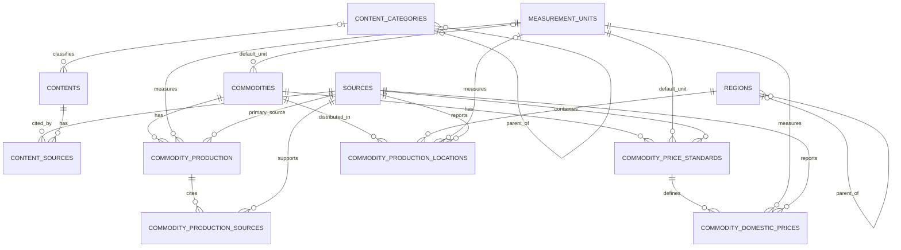

# MineVision Database Schema

Dokumen ini mencatat struktur database aktif MineVision, relasi antartabel, constraint utama, serta aturan perubahan schema.

Detail API, keamanan, tata kelola data, dan rencana tabel berikutnya berada pada dokumen masing-masing.

## 1. Database Stack

| Komponen | Teknologi |
|---|---|
| Database | PostgreSQL melalui Supabase |
| ORM | Drizzle ORM |
| Migration | Drizzle Kit |
| Schema | TypeScript |
| Database client | postgres.js |
| Runtime validation | Zod |
| Primary key utama | UUID |
| Timestamp | `timestamp with time zone` |

## 2. Database Files

```text
/src/db/
    /index.ts
    /schema/
        /common.ts
        /sources.ts
        /content.ts
        /content-sources.ts
        /measurement-units.ts
        /commodities.ts
        /commodity-production.ts
        /commodity-production-sources.ts
        /commodity-prices.ts
        /regions.ts
        /commodity-production-locations.ts
        /index.ts

/drizzle/
    /migration SQL
    /meta/

/scripts/
    /seed.ts
    /verify-database.ts
    /import-intelligence.ts
    /verify-intelligence-import.ts
```

Schema TypeScript pada `src/db/schema` merupakan sumber utama struktur database.

## 3. Database Connection

Aplikasi menggunakan:

```text
DATABASE_URL
```

Database hanya boleh diakses melalui kode server-side, seperti:

- Server Component;
- Route Handler;
- Server Action;
- server service;
- migration;
- seed;
- ingestion script.

Database credential tidak boleh menggunakan prefix `NEXT_PUBLIC_`.

## 4. Shared Columns

Sebagian besar tabel menggunakan:

| Kolom | Tipe | Keterangan |
|---|---|---|
| `created_at` | `timestamptz` | Waktu record dibuat |
| `updated_at` | `timestamptz` | Waktu record diperbarui |

`updated_at` harus diperbarui secara eksplisit ketika record berubah.

## 5. Database Enums

### Publication Status

```text
draft
in_review
published
archived
```

### Verification Status

```text
pending
verified
rejected
```

### Source Type

```text
government
statistics_agency
company_report
academic
regulation
market_data
other
```

### Content Module

```text
education
industry
commodities
career
intelligence
economy
about
```

### Content Type

```text
article
glossary
company_profile
commodity_profile
profession
data_insight
policy
page
```

### Commodity Category

```text
metal_mineral
non_metal_mineral
energy
```

### Measurement Category

```text
mass
currency
currency_per_mass
percentage
energy
count
other
```

### Data Record Type

```text
actual
provisional
projection
revised
```

### Price Period

```text
daily
weekly
monthly
quarterly
annual
custom
```

### Region Level

```text
country
province
regency
city
```

## 6. Entity Relationship Diagram



## 7. Table Inventory

| Tabel | Fungsi |
|---|---|
| `sources` | Master sumber data |
| `content_categories` | Kategori konten |
| `contents` | Konten MineVision |
| `content_sources` | Sitasi sumber konten |
| `measurement_units` | Master satuan |
| `commodities` | Master komoditas |
| `commodity_production` | Produksi nasional per tahun |
| `commodity_production_sources` | Sitasi data produksi |
| `commodity_price_standards` | Standar harga komoditas |
| `commodity_domestic_prices` | Data harga domestik |
| `regions` | Master wilayah |
| `commodity_production_locations` | Data produksi berdasarkan wilayah |

## 8. Table Specifications

### 8.1 `sources`

Master sumber data yang digunakan oleh konten dan data intelligence.

| Kolom | Tipe | Aturan |
|---|---|---|
| `id` | UUID | Primary key |
| `name` | varchar(200) | Wajib |
| `slug` | varchar(220) | Unik |
| `type` | `source_type` | Jenis sumber |
| `organization` | varchar(200) | Wajib |
| `url` | text | Opsional |
| `description` | text | Opsional |
| `is_official` | boolean | Status sumber resmi |
| `verification_status` | `verification_status` | Default `pending` |
| `verified_at` | timestamptz | Waktu verifikasi |
| `is_active` | boolean | Status aktif |

Sumber publik harus aktif dan terverifikasi.

### 8.2 `content_categories`

Kategori untuk setiap modul konten.

| Kolom | Tipe | Aturan |
|---|---|---|
| `id` | UUID | Primary key |
| `module` | `content_module` | Modul kategori |
| `parent_id` | UUID | FK ke tabel yang sama, opsional |
| `name` | varchar(160) | Wajib |
| `slug` | varchar(180) | Wajib |
| `description` | text | Opsional |
| `display_order` | integer | Urutan tampilan |
| `is_active` | boolean | Status aktif |

Constraint:

```text
UNIQUE (module, slug)
```

Jika parent dihapus, `parent_id` pada child menjadi `NULL`.

### 8.3 `contents`

Konten untuk Education, Industry, Commodities, Career, Intelligence, Economy, dan About.

| Kolom | Tipe | Aturan |
|---|---|---|
| `id` | UUID | Primary key |
| `module` | `content_module` | Modul konten |
| `type` | `content_type` | Jenis konten |
| `category_id` | UUID | FK kategori, opsional |
| `title` | varchar(240) | Wajib |
| `slug` | varchar(260) | Wajib |
| `excerpt` | text | Ringkasan |
| `body` | text | Isi konten |
| `cover_image_url` | text | Opsional |
| `status` | `publication_status` | Status publikasi |
| `published_at` | timestamptz | Waktu publikasi |
| `reading_time_minutes` | integer | Estimasi waktu baca |
| `is_featured` | boolean | Konten unggulan |
| `metadata` | jsonb | Metadata tambahan |

Constraint:

```text
UNIQUE (module, slug)
```

Konten publik hanya mengambil:

```text
status = published
```

### 8.4 `content_sources`

Relasi antara konten dan sumber.

| Kolom | Tipe | Aturan |
|---|---|---|
| `content_id` | UUID | FK ke `contents` |
| `source_id` | UUID | FK ke `sources` |
| `citation_label` | text | Label sitasi |
| `page_reference` | text | Referensi halaman |
| `notes` | text | Catatan |
| `accessed_at` | timestamptz | Waktu akses |
| `display_order` | integer | Urutan sitasi |

Primary key:

```text
PRIMARY KEY (content_id, source_id)
```

Relasi dihapus ketika content dihapus. Source tidak boleh dihapus jika masih digunakan.

### 8.5 `measurement_units`

Master satuan untuk produksi, harga, persentase, dan data numerik lainnya.

| Kolom | Tipe | Aturan |
|---|---|---|
| `code` | varchar(50) | Primary key |
| `name` | varchar(120) | Wajib |
| `symbol` | varchar(30) | Wajib |
| `category` | `measurement_category` | Kategori satuan |
| `description` | text | Opsional |
| `is_active` | boolean | Status aktif |

Contoh kode:

```text
ton
million_ton
kg
gram
usd_per_ton
idr_per_gram
```

Unit yang sudah tersedia pada master tidak boleh ditulis bebas pada record data.

### 8.6 `commodities`

Master komoditas pertambangan.

| Kolom | Tipe | Aturan |
|---|---|---|
| `id` | UUID | Primary key |
| `name` | varchar(160) | Wajib |
| `slug` | varchar(180) | Unik |
| `symbol` | varchar(30) | Opsional |
| `category` | `commodity_category` | Kategori komoditas |
| `description` | text | Deskripsi |
| `specification` | text | Spesifikasi |
| `default_production_unit_code` | varchar(50) | FK ke `measurement_units` |
| `image_url` | text | Opsional |
| `is_intelligence_tracked` | boolean | Masuk Intelligence |
| `display_order` | integer | Urutan tampilan |
| `is_active` | boolean | Status aktif |
| `metadata` | jsonb | Metadata tambahan |

Public Intelligence hanya menggunakan komoditas aktif dengan `is_intelligence_tracked = true`.

### 8.7 `commodity_production`

Produksi nasional komoditas berdasarkan tahun.

| Kolom | Tipe | Aturan |
|---|---|---|
| `id` | UUID | Primary key |
| `commodity_id` | UUID | FK ke `commodities` |
| `year` | smallint | `1900–2100` |
| `production_value` | numeric(24,6) | Minimal `0` |
| `unit_code` | varchar(50) | FK ke `measurement_units` |
| `record_type` | `data_record_type` | Jenis record |
| `source_id` | UUID | Sumber utama |
| `verification_status` | `verification_status` | Status verifikasi |
| `publication_status` | `publication_status` | Status publikasi |
| `notes` | text | Opsional |

Constraint:

```text
UNIQUE (commodity_id, year, record_type)
```

### 8.8 `commodity_production_sources`

Sitasi pendukung untuk data produksi.

| Kolom | Tipe | Aturan |
|---|---|---|
| `id` | UUID | Primary key |
| `production_id` | UUID | FK ke `commodity_production` |
| `source_id` | UUID | FK ke `sources` |
| `citation_label` | varchar(255) | Label sitasi |
| `source_url` | text | URL spesifik |
| `page_reference` | varchar(100) | Referensi halaman |
| `is_primary` | boolean | Sitasi utama |

Constraint:

```text
UNIQUE (production_id, source_id, citation_label)
```

`commodity_production.source_id` menyimpan sumber utama, sedangkan tabel ini menyimpan sitasi yang lebih lengkap.

### 8.9 `commodity_price_standards`

Master standar harga untuk setiap komoditas.

| Kolom | Tipe | Aturan |
|---|---|---|
| `id` | UUID | Primary key |
| `commodity_id` | UUID | FK ke `commodities` |
| `code` | varchar(60) | Unik |
| `name` | varchar(200) | Wajib |
| `description` | text | Opsional |
| `methodology` | text | Metode penetapan |
| `default_currency_code` | varchar(3) | Contoh `IDR`, `USD` |
| `default_unit_code` | varchar(50) | FK ke `measurement_units` |
| `issuing_source_id` | UUID | FK ke `sources` |
| `is_active` | boolean | Status aktif |

Constraint:

```text
UNIQUE (code)
UNIQUE (commodity_id, name)
```

### 8.10 `commodity_domestic_prices`

Nilai harga domestik berdasarkan standar harga.

| Kolom | Tipe | Aturan |
|---|---|---|
| `id` | UUID | Primary key |
| `price_standard_id` | UUID | FK ke standar harga |
| `effective_date` | date | Tanggal berlaku |
| `period` | `price_period` | Periode harga |
| `period_label` | varchar(100) | Label periode |
| `price_value` | numeric(24,6) | Minimal `0` |
| `currency_code` | varchar(3) | Tiga huruf kapital |
| `unit_code` | varchar(50) | FK ke `measurement_units` |
| `record_type` | `data_record_type` | Jenis record |
| `source_id` | UUID | FK ke `sources` |
| `verification_status` | `verification_status` | Status verifikasi |
| `publication_status` | `publication_status` | Status publikasi |
| `notes` | text | Opsional |

Constraint:

```text
UNIQUE (price_standard_id, effective_date, record_type)
```

### 8.11 `regions`

Master wilayah secara hierarkis.

| Kolom | Tipe | Aturan |
|---|---|---|
| `id` | UUID | Primary key |
| `parent_id` | UUID | FK ke tabel yang sama |
| `code` | varchar(30) | Kode wilayah |
| `name` | varchar(160) | Wajib |
| `slug` | varchar(180) | Unik |
| `level` | `region_level` | Tingkat wilayah |
| `latitude` | numeric(10,7) | `-90` sampai `90` |
| `longitude` | numeric(10,7) | `-180` sampai `180` |
| `metadata` | jsonb | Metadata tambahan |
| `is_active` | boolean | Status aktif |

Contoh hierarki:

```text
Indonesia
└── Kalimantan Timur
    └── Kutai Kartanegara
```

### 8.12 `commodity_production_locations`

Produksi, kontribusi, atau peringkat komoditas berdasarkan wilayah.

| Kolom | Tipe | Aturan |
|---|---|---|
| `id` | UUID | Primary key |
| `commodity_id` | UUID | FK ke `commodities` |
| `region_id` | UUID | FK ke `regions` |
| `year` | smallint | `1900–2100` |
| `production_value` | numeric(24,6) | Opsional, minimal `0` |
| `unit_code` | varchar(50) | Wajib jika nilai produksi tersedia |
| `share_percentage` | numeric(7,4) | Opsional, `0–100` |
| `producer_rank` | smallint | Opsional, lebih dari `0` |
| `record_type` | `data_record_type` | Jenis record |
| `source_id` | UUID | FK ke `sources` |
| `verification_status` | `verification_status` | Status verifikasi |
| `publication_status` | `publication_status` | Status publikasi |
| `notes` | text | Opsional |

Constraint:

```text
UNIQUE (commodity_id, region_id, year, record_type)
```

Setiap record wajib memiliki minimal salah satu dari:

```text
production_value
share_percentage
producer_rank
```

## 9. Public Data Rules

Data Intelligence hanya boleh ditampilkan kepada publik jika:

```text
verification_status = verified
publication_status = published
```

Sumber harus memenuhi:

```text
sources.is_active = true
sources.verification_status = verified
```

Komoditas harus memenuhi:

```text
commodities.is_active = true
commodities.is_intelligence_tracked = true
```

Filter tersebut harus diterapkan pada server query, bukan hanya pada frontend.

## 10. Numeric Data

Kolom produksi, harga, persentase, dan koordinat menggunakan PostgreSQL `numeric`.

Database driver dapat mengembalikan nilai `numeric` sebagai string. Konversi ke JavaScript `number` hanya dilakukan setelah rentang dan kebutuhan presisinya diperiksa.

Nilai finansial tidak boleh dibulatkan sebelum proses perhitungan selesai.

## 11. Row Level Security

RLS telah diaktifkan pada seluruh tabel aktif.

Status saat ini:

```text
RLS enabled
Explicit policies belum final
```

RLS aktif tidak berarti policy akses sudah selesai. Sebelum database dapat diakses langsung dari browser, public, authenticated, admin, dan service policy harus dibuat serta diuji.

Untuk saat ini, akses public tetap melalui:

```text
Browser
→ Next.js server
→ Drizzle ORM
→ PostgreSQL
```

## 12. Migration History

| Migration | Fungsi |
|---|---|
| `0000_core-sources.sql` | Master sumber |
| `0001_enable-sources-rls.sql` | Mengaktifkan RLS pada sumber |
| `0002_core-content.sql` | Konten, kategori, dan sumber |
| `0003_intelligence-master-data.sql` | Master komoditas dan unit |
| `0004_commodity-production.sql` | Produksi komoditas |
| `0005_commodity-domestic-prices.sql` | Standar dan harga domestik |
| `0006_regions-production-locations.sql` | Wilayah dan produksi lokasi |
| `0007_goofy_siren.sql` | Sitasi sumber produksi |

Migration yang telah digunakan tidak boleh diedit. Perubahan berikutnya harus dibuat melalui migration baru.

## 13. Schema Change Workflow

Urutan perubahan database:

1. ubah Drizzle schema;
2. export schema melalui `src/db/schema/index.ts`;
3. generate migration;
4. periksa migration SQL;
5. jalankan migration;
6. jalankan seed jika diperlukan;
7. jalankan database verification;
8. jalankan pemeriksaan project;
9. commit schema dan migration bersama-sama.

Perintah:

```bash
npm run db:generate
npm run db:check
npm run db:migrate
npm run db:seed
npm run db:verify
npx tsc --noEmit
npm run lint
npm run build
```

Jalankan hanya perintah yang relevan. Jangan menjalankan seed ulang jika tidak dibutuhkan.

## 14. Database Rules

- Jangan mengubah production database secara langsung.
- Jangan membuat tabel hanya melalui Supabase Table Editor.
- Jangan menghapus migration yang sudah digunakan.
- Jangan menghapus tabel atau kolom tanpa pemeriksaan dampak.
- Gunakan foreign key untuk relasi antartabel.
- Gunakan master satuan untuk data terukur.
- Gunakan migration untuk seluruh perubahan schema.
- Perbarui dokumen ini jika struktur database berubah.

## 15. Current Scope

Schema saat ini mencakup:

- sumber data;
- konten;
- komoditas;
- satuan;
- produksi nasional;
- sitasi produksi;
- standar harga;
- harga domestik;
- wilayah;
- produksi berdasarkan wilayah.

Schema untuk authentication, Admin Dashboard, audit log, ekonomi, search, dan MineBot ditambahkan sesuai prioritas pada `ROADMAP.md`.

## 16. Definition of Done

Perubahan database selesai jika:

- Drizzle schema valid;
- migration telah diperiksa;
- primary key dan foreign key benar;
- constraint sesuai kebutuhan;
- tidak ada destructive operation yang tidak disengaja;
- RLS tetap aktif;
- seed tetap aman dijalankan ulang;
- `npm run db:verify` berhasil;
- type check, lint, dan build berhasil;
- schema dan migration tetap sinkron;
- dokumentasi ini diperbarui.